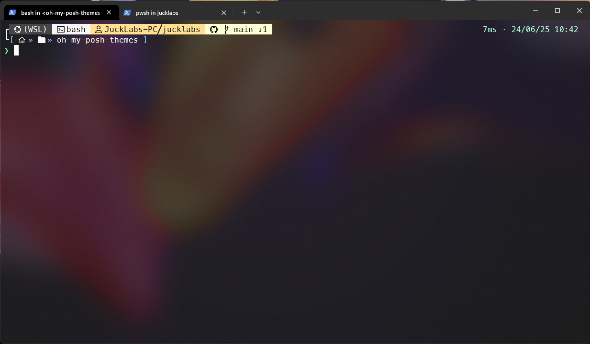

# oh-my-posh-themes
custom terminal themes for oh-my-posh

## hul10 (modified)
Based on [hul10](https://github.com/JanDeDobbeleer/oh-my-posh/blob/main/themes/hul10.omp.json)
This is the hul10 theme updated to include git branch status information, such as upstream changes or commits

